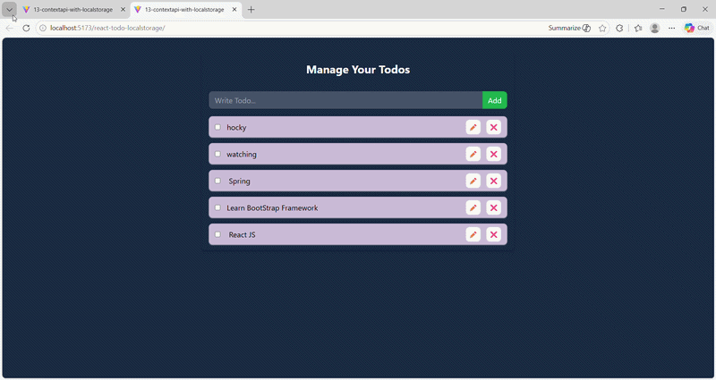
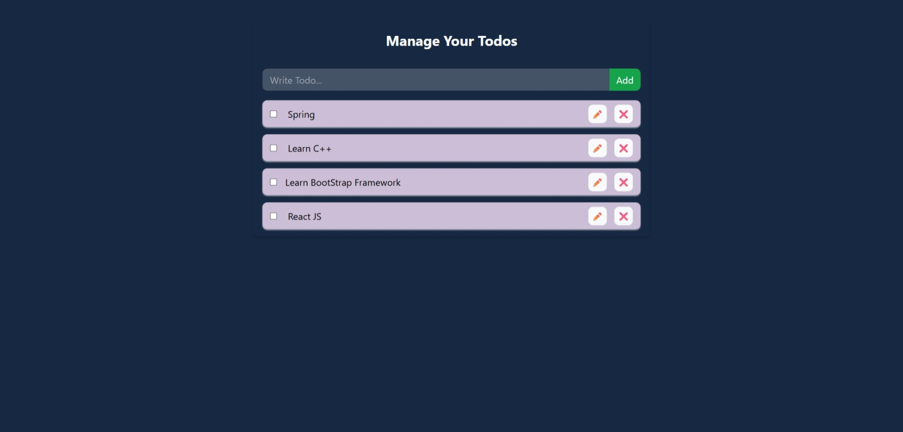
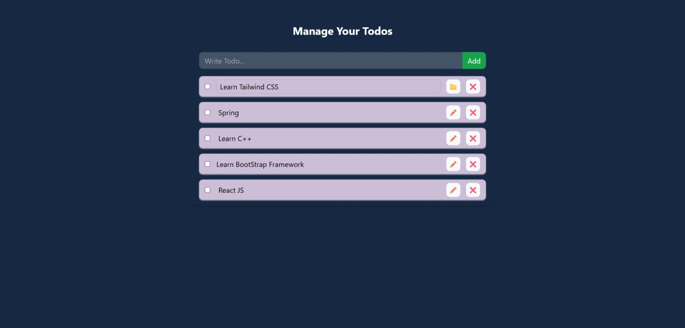
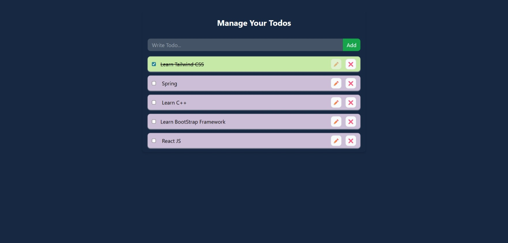

# 📝 React Todo App (LocalStorage)


A modern, efficient, and fully responsive **Todo Application** built using **React**, designed to help users manage daily tasks with persistent storage using the browser's **LocalStorage API**.

---

## 🚀 Live Demo

🌐 **Live App:** https://khushi-66.github.io/react-todo-localstorage/

📂 **GitHub Repository:** https://github.com/khushi-66/react-todo-localstorage

---

## 🎥 Live Preview



---

## 📌 Overview

This project showcases a real-world implementation of **task management functionality** using React.

It demonstrates:

* Efficient **state management** using React Hooks
* Handling **side effects** with `useEffect`
* Persistent data storage using **LocalStorage**
* Clean and scalable **component-based architecture**

---

## 🧠 Key Learnings

* Managing application state using `useState`
* Synchronizing data with LocalStorage using `useEffect`
* Structuring reusable React components
* Handling user interactions and events efficiently
* Building responsive UI with clean design principles

---

## 📸 Screenshots

### 🏠 Main Interface



### ✅ Task Management
### ✏️ Completed  Task



### ✏️ Add  Task




### ✏️ Add  Task


### 📱 Mobile View


---

## ✨ Features

* ➕ Add new tasks
* ✏️ Edit existing tasks
* ❌ Delete tasks
* ✔️ Mark tasks as completed
* 💾 Persistent storage using LocalStorage
* ⚡ Instant UI updates (real-time rendering)
* 📱 Fully responsive design

---

## ⚡ Performance & Optimization

* Optimized re-renders using efficient state updates
* Minimal and lightweight component structure
* Fast data retrieval using LocalStorage
* Smooth user experience with instant updates

---

## 🛠️ Tech Stack

| Technology            | Usage            |
| --------------------- | ---------------- |
| **React.js**          | Frontend         |
| **JavaScript (ES6+)** | Logic            |
| **CSS**               | Styling          |
| **LocalStorage API**  | Data persistence |

---

## 🌐 Deployment

This project is deployed using **GitHub Pages**, making it publicly accessible.

### 🚀 Deployment Process:

* Built the React app for production
* Deployed using GitHub Pages
* Hosted directly from the repository
* Generated live URL for easy access

---

## 📂 Project Structure

```bash
react-todo-localstorage/
│── public/
│── src/
│   ├── components/
│   ├── hooks/
│   ├── App.jsx
│   └── main.jsx
│── screenshots/
│── assets/
│── package.json
│── README.md
```

---

## ⚙️ Installation & Setup

```bash
git clone https://github.com/khushi-66/react-todo-localstorage.git
cd react-todo-localstorage
npm install
npm run dev
```

---

## 📈 Future Improvements

* 🌙 Dark mode toggle
* ⭐ Task priority system
* 📅 Due dates & reminders
* 🔍 Search & filter tasks
* ☁️ Cloud sync (Firebase / backend integration)

---

## 👩‍💻 Author

**Khushi Sahu**
🔗 https://github.com/khushi-66

---

## ⭐ Support

If you like this project, give it a ⭐ on GitHub!
